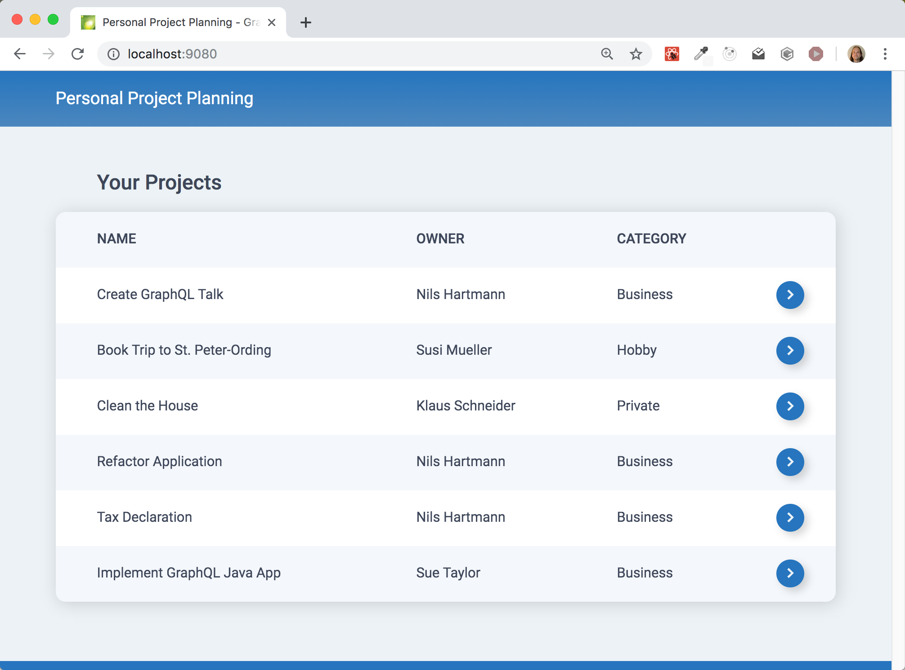

# GraphQL Example Application "Project Management"

This repository contains a very simple GraphQL example application, using the following technology stack:

- [graphql-java](https://www.graphql-java.com/)
- [Spring Boot](https://spring.io/guides/gs/spring-boot/)
- [React](https://reactjs.org/)
- [TypeScript](https://www.typescriptlang.org/)
- [Apollo GraphQL for React](https://github.com/apollographql/react-apollo)

# Installing and starting

Required software:

- Java/JDK 11 (I've used OpenJDK 11 for development)
- NodeJS (version 10.x, version 12.x [does not work currently](https://github.com/nilshartmann/graphql-project-example/issues/1))
- yarn (I'm using version 1.16, but other versions should work too).
- alternative: npm might work instead of yarn, but you need npm version 6.4.x)

Prerequisites:

- Port 9000 must be available for the backend
- Port 9080 must be available for the frontend webserver
- You need to have installed Java/JDK 11 for the backend and `yarn` for the frontend build and dependency management (`npm` might also work)

Prepare: Clone this repository

1. `git clone https://github.com/nilshartmann/graphql-project-example.git`

Step 1: Build and start the backend

1. Open a terminal inside the `backend` folder
2. Run `./gradlew bootRun` to start the Spring Boot-based application.
3. The application now should listen on port 9000.

Step 2: Install, build and start the frontend

1. Open a new terminal inside the `frontend` folder
2. Install the npm packages: `yarn install`
3. Start the webpack web server: `yarn start`
4. The webserver now should listen on http://localhost:9080

Now everything runs. You can open in your browser:

- http://localhost:9080 for the demo application frontend
- http://localhost:9000/graphiql.html for the [GraphiQL](https://github.com/graphql/graphiql) API Explorer

Enjoy! 💐

# Problems, Questions, Contact

If you have any problems, comments or question, don't hesitate to contact me. You can either open an issue in this repository, find me on [Twitter](https://twitter.com/nilshartmann) or on [some more channels](https://nilshartmann.net/contact/).

# Article on GraphQL

I've written a (german) article about GraphQL, React and TypeScript that uses this example application in the iX newspaper. You can read the article [here online](https://www.heise.de/select/ix/2019/6/1909808311106276205) (Note: behind paywall).

You can find even more of my articles, talks and workshops about GraphQL [here](https://nilshartmann.net/posts/graphql-workshop-und-vortraege/) (in german only)
